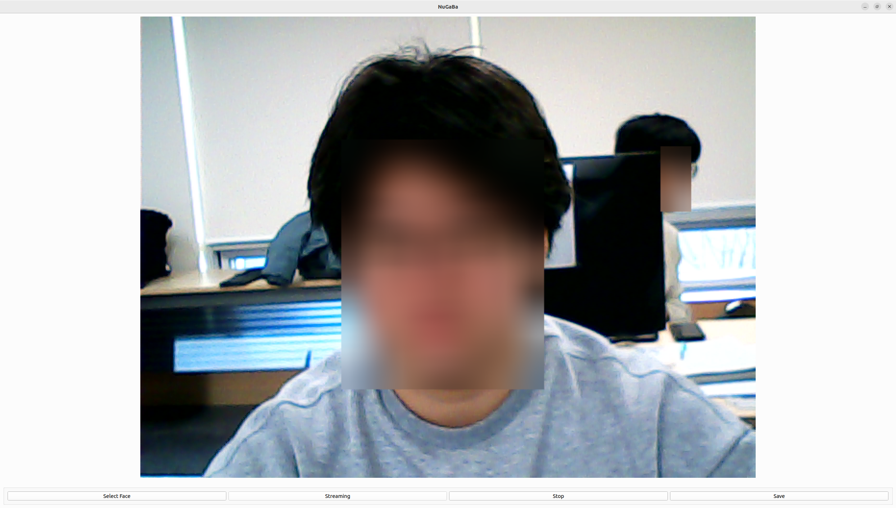

# Team 3 [누가바] Repository [OnTheEdge]

# Project [Face Privacy]

## Project Overview
### 개발 배경
최근, 많은 사람들이 가까운 지인과의 소식 전달을 위하여 Social Network Service(이하 'SNS'라 지칭함)를 이용하고 있다. 특히, 스마트폰이나 타블릿 PC와 같은 이동 기기들이 급속하게 보급되어 장소의 구분 없이 사용자들은 다양한 사진, 동영상을 생성하여 SNS 서비스 플랫폼에 업로드할 수 있으며, 해당 SNS 서비스 플랫폼에 접속한 다른 사용자들에게 실시간 배포할 수 있게 되었다. <br>
이와 같이, 실시간으로 정보를 송수신할 수 있는 SNS 서비스 플랫폼의 폭발적인 확산에 따라 정보의 확산이 급속히 이뤄지고 있다. 그러나, 사용자가 사진이나 영상을 촬영하여 SNS 서비스 플랫폼에 업로드하여 게시하고자 할 경우, 무분별한 타인의 얼굴 등 의도하지 않은 정보가 유출될 수 있으며, 이에 따라 다양한 문제가 발생되기도 한다. <br>
이에 일부 사용자들의 경우 SNS 서비스 플랫폼에 사진을 업로드하고자 할 경우, 개인 정보가 유출될 수 있는 특정 영역을 모자이크 처리한 후 업로드하고 있다. 예컨대, 관련성이 없는 타인의 얼굴, 차량 번호판 등을 직접 모자이크 처리한 후 업로드하는 방식이다. <br>
그러나, 종래의 방식에서는 사용자가 직접 사진 하나하나 특정 영역을 지정하여 모자이크 처리하는 방식으로, 업로드에 많은 시간이 소요되며, 사용자의 불편함이 야기된다는 문제점이 있다. 또한, 종래의 방식에서는 동영상의 경우 모자이크를 처리할 수 있는 방안이 상당히 불편하다는 문제점이 있다. <br>
본 발명은 영상에서 특정 영역만(face)을 모자이크 처리하여 정보 게시 서비스를 통해 게시하고, 개인정보 공개를 원하는 사용자에 따라 특정 손 모션 동작을 인식시켜 선별적으로 모자이크를 해제하여 배포 및 중계할 수 있는 영상 모자이크 처리 방법 및 이를 위한 장치에 관한 것으로, 이를 위한 본 발명의 서비스 서버는 영상에서 모자이크 처리가 필요한 영역을 확인하고, 상기 모자이크 처리가 필요한 영역 각각에 대한 AI face 인식 및 상기 AI 모델 저장부에 저장된 face 값에 대응하는 사용자 face 식별 정보를 확인하고, 상기 확인된 킷값(이하 킷값이라 한다.) 및 사용자 식별 정보를 이용하여 상기 모자이크 처리가 필요한 영역을 추출하여 모자이크를 수행하고, 상기 모자이크가 수행된 영역을 포함하는 영상을 저장 및 실시간 중계하여 상기 정보 게시 서비스에 게시되도록 제어하는 단계를 수행할 수 있다.<br><br>

### 해결하려는 과제
본 발명은 상기한 종래의 문제점을 해결하기 위해 제안된 것으로서, 영상에서 특정 영역만을 모자이크 처리하여 정보 게시 서비스를 통해 게시하고, 개인정보 공개를 원하는 사용자에 따라 특정 손 모션 동작을 인식시켜 선별적으로 모자이크를 해제하여 배포할 수 있는 영상 모자이크 처리 방법 및 이를 위한 장치를 제공한다. 특히, 본 발명은 영상에서 얼굴 영역을 추출하고, 추출된 얼굴 영역에 대응하여 얼굴 키 값을 이용하여 해당 얼굴 영역을 모자이크 처리하고 영상을 중계 및 재생하며, 영상 배포 시, 출연자의 개인정보 공개 여부에 따라 손 모션 동작에 의해 선별적으로 모자이크를 해제한 후 중계 및 배포할 수 있는 영상 모자이크 처리 방법 및 이를 위한 장치를 제공하는 데 그 목적이 있다.<br><br>

### 솔루션 동작 흐름 설명
* 상기 모자이크 처리가 필요한 영역을 확인하는 단계는 상기 수신된 영상에서 얼굴 영역을 추출하여 확인하며, 상기 키 값은 상기 얼굴 영역에 대한 얼굴 키 값일 수 있다.
* 또한 상기 모자이크 처리가 필요한 영역을 확인하는 단계는
  - 상기 수신된 영상에서 얼굴 영역을 추출하는 단계;
  - 상기 추출된 얼굴 영역이 복수 개인 경우, 복수 개의 얼굴 영역의 크기를 비교하는 단계;
  - 상기 비교 결과, 일정 크기 이상인 얼굴 영역을 모자이크 처리가 필요한 영역으로 확인하고, 그렇지 않은 얼굴 영역은 무조건 모자이크 처리하는 단계를 포함하여 이뤄질 수 있다
* 영상생성장치로부터 발신 및 수신된 영상을 특정 정보 게시 서비스에 공유하고자 하는 서비스 서버에 있어서,
  - 상기 서비스 서버가, 상기 수신된 영상에서 모자이크 처리가 필요한 하나 이상의 영역을 추출하는 단계;
  - 상기 모자이크 처리가 필요한 하나 이상의 영역 각각에 대하여, 해당 영역으로부터 추출된 특징점에 대한 시그니처 값을 이용하여 키 값을 생성하고, 상기 키 값에 매핑되어 저장된 사용자 식별 정보를 확인하는 단계;
  - 상기 모자이크 처리가 필요한 하나 이상의 영역 각각에 대하여, 상기 생성한 키 값 및 AI에 저장부에 저장된 사용자 식별 정보를 이용하여 사용자를 인식하는 단계를 포함하는 것을 특징으로 하는 영상 모자이크 처리 방법.
* 상기 추출된 하나 이상의 얼굴 영역의 크기를 비교하는 단계 및 상기 비교 결과, 일정 크기 이상인 얼굴 영역을 모자이크 처리가 필요한 영역으로 확인하고, 그렇지 않은 얼굴 영역은 무조건 모자이크 처리하는 단계를 포함하는 것을 특징으로 하는 영상 모자이크 처리 방법.
* 상기 사용자 식별 정보를 확인하는 단계에서, 상기 키 값에 대응하는 사용자 식별 정보가 존재하지 않을 경우, 상기 영상을 생성 또는 게시하고자 하는 사용자 식별 정보를 확인하는 것을 특징으로 하는 영상 모자이크 처리 방법.
* 특정 손 모션 동작에 따라 각 특정 인물의 얼굴을 모자이크 처리 여부를 판단하고 실행
  1. 영상 속 인물들의 얼굴은 일괄 모자이크 처리
  2. 영상 속 인물이 팔을 들어 다섯 손가락을 모두 펴면 블러처리 해제
  3. 영상 속 인물이 팔을 들어 주먹을 쥐면 블러처리 실행
  4. (추가기능) 검지 손가락만 들면 블러처리 된 영역에 이모티콘 형상을 구현
<br><br>

### 발명의 효과
본 발명의 영상 모자이크 처리 방법 및 이를 위한 장치에 의하면, 영상을 생성한 영상생성장치가 생성된 영상을 특정 서비스를 통해 게시하여 배포하고자 할 경우, 영상에서 특정 영역만을 모자이크 처리하여 업로드할 수 있어 사용자가 직접 영역 하나하나를 지정하여 모자이크를 처리할 필요가 없어 사용자의 편의성이 높아질 수 있다.<br>
또한, 본 발명에 의하면 특정 서비스를 통해 게시된 영상을 재생하고자 하는 사용자에 따라 선별적으로 모자이크를 해제하여 배포함으로써, SNS 서비스 플랫폼을 통해 무분별한 개인 영상 정보가 유포되는 것을 사전에 방지할 수 있게 된다.<br>
또한, 본 발명에 의하면, 영상을 생성한 사용자와 영상을 재생 요청한 사용자 간의 관계를 이용하여 모자이크가 설정된 영역의 모자이크를 차등적으로 해제하여 배포할 수 있어 개인 정보를 보다 더 강화함과 동시에 색다른 서비스를 제공할 수 있게 된다.<br><br>

## High Level Design


## Use Case

 


## Class Diagram


## Sequence Diagram


## Cloning the code

```shell
https://github.com/Team-Intel-Edge-AI/OnTheEdge.git  # HTTPS
# git@github.com:Team-Intel-Edge-AI/OnTheEdge.git  # SSH
# gh repo clone Team-Intel-Edge-AI/OnTheEdge  # GitHub CLI
```

## Prerequisites

* The following code assumes Python 3.10 is installed on the computer. Please install Python 3.10 if not already installed.
* 이하 코드는 컴퓨터에 파이썬 3.10버전이 설치되어있다고 가정합니다. 만약 파이썬을 설치하시지 않으셨다면 파이썬 3.10버전을 먼저 설치해주세요.

```shell
python -m venv .edge_env
source .edge_env/bin/activate
pip install --upgrade pip
pip install openvino==2023.2.0, opencv-python, numpy, scipy, mediapipe, PySide6
sudo apt-get update
sudo apt-get install -y qt5-default libxcb-xinerama0-dev
sudo apt install libxcb-icccm4 libxcb-image0 libxcb-keysyms1 libxcb-render-util0
sudo apt install libxcb-cursor0
```

## Steps to build

* This code does not require building and can be run immediately after creating a Python virtual environment and installing the required libraries.
* 해당 코드는 별도로 빌드할 필요가 없으며 저장소 클로닝 후 가상환경 생성, 필요한 라이브러리 설치 후 바로 실행하면된다.


## Steps to run
```shell
# Activate prepared Python virtual environment
# ex) source .edge_env/bin/activate

# Navigate to this cloned repo
cd ~/<repo>/dev/combined

# Execute following to run
python3 gui.py  # For Linux
# python gui.py  # For Windows
```

## Output


## Appendix

* (참고 자료 및 알아두어야할 사항들 기술)
